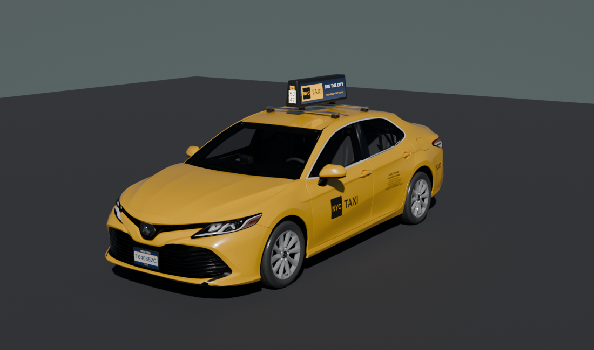
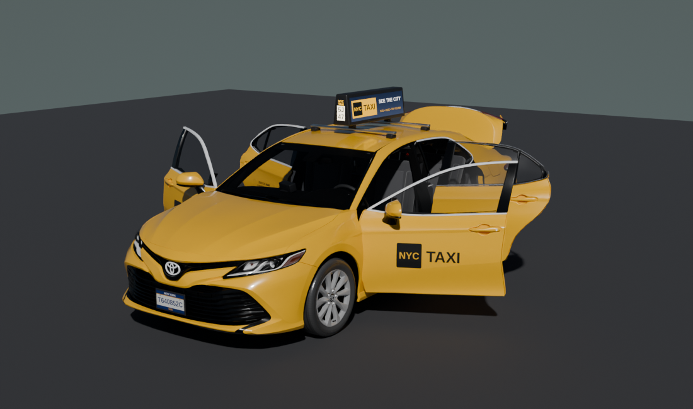
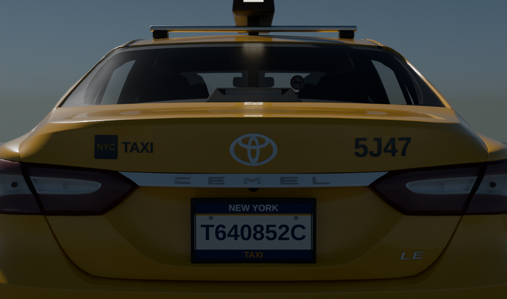
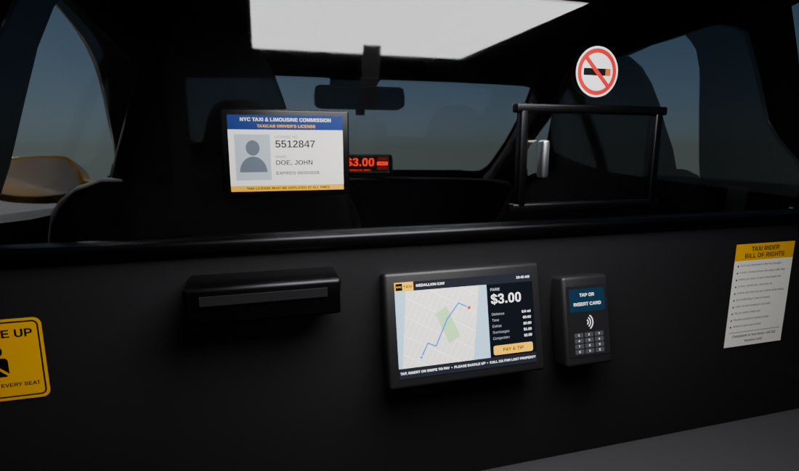
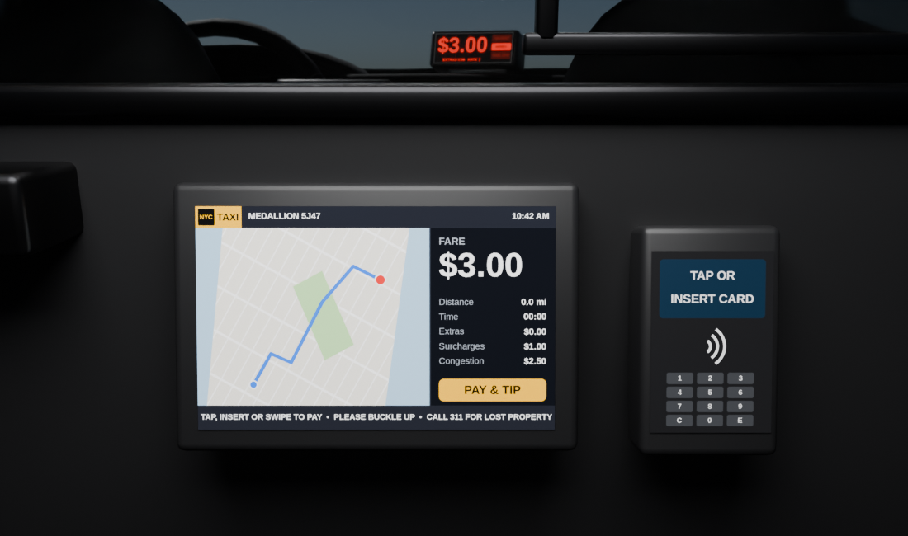
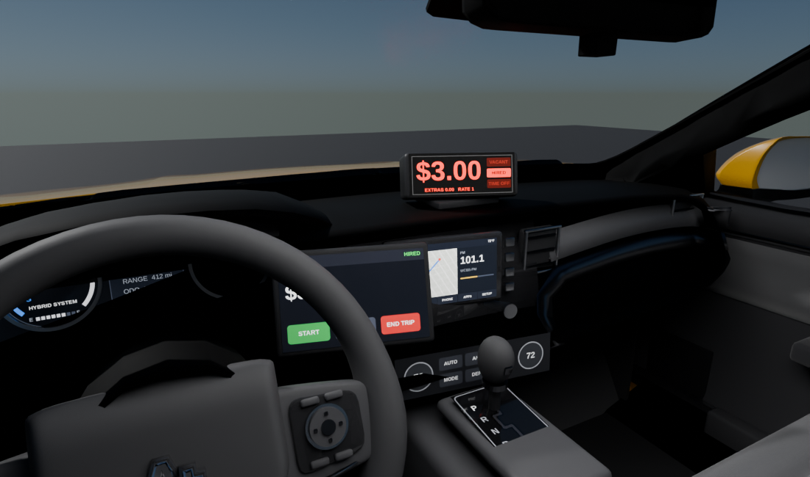
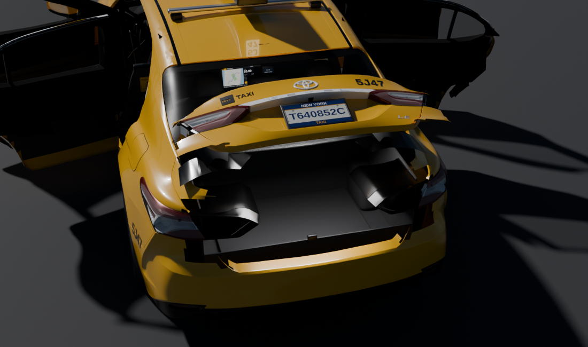
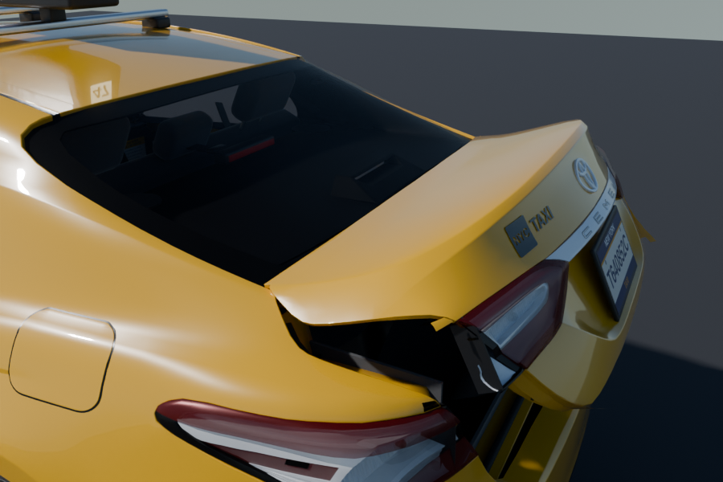

# NYC Taxi – Cemel 2020

A New York City yellow cab, the **Cemel 2020**, built from the Sketchfab
[Toyota Camry 2020](https://sketchfab.com/3d-models/toyota-camry-2020-236a5a6e2fa6420fbdf641f4800cd544)
model (source credit). All four doors and the trunk lid open on their own hinges, and the cabin is
fitted out like a real NYC yellow cab.







## Files

| File | What it is |
| --- | --- |
| `NYC_Taxi_Cemel_2020.blend` | The taxi. Textures are packed, units are metres, and the car is centred on the origin with its tyres on z = 0. |
| `NYC_Taxi_Cemel_2020.glb` | The same taxi as a glTF binary for game engines and web viewers (car only, no studio). Doors and trunk are separate nodes with open animations. |
| `textures/` | Livery textures and interior textures (`interior_*.png`). Edit them and rebuild to change the medallion number, plate, ad, fare screen or notices. |
| `scripts/` | The build pipeline (see below). |
| `renders/` | Cycles preview renders. `original_before.png` shows the source model. |

## Opening the doors and trunk

The doors and the trunk lid are separate objects in the `Doors_Trunk` collection. Each object's
origin is on its hinge line.

| Object | Hinge | Fully open |
| --- | --- | --- |
| `Door_FL`, `Door_FR` | vertical, at the front edge of the door | 65° |
| `Door_RL`, `Door_RR` | vertical, at the B-pillar | 70° |
| `Trunk_Lid` | across the car, under the rear window | 72° |

- **In Blender:** select a door or the lid. Under Object Properties > Custom Properties, drag
  **`open`** from 0 (shut) to 1 (fully open). A driver turns this into the hinge angle, so each part
  opens on its own. You can also keyframe `open`.
- **In glTF (game engines, three.js, Babylon, and so on):** each part is a node with its pivot on
  the hinge. There is one animation per part, `Door_FL_Open`, `Door_FR_Open`, `Door_RL_Open`,
  `Door_RR_Open` and `Trunk_Lid_Open`, each running from shut to open over 30 frames. You can play
  them separately, or set the node's rotation yourself.

Everything that sits on a moving panel moves with it:
- the door logos and rate-of-fare decals
- the mirrors, handles, window glass and frames
- the lower door cards and front speaker grilles
- on the trunk lid: the badge, the lid lamps, the rear plate and the medallion decals.

## What changed

**Real-world scale.** The source was about 1:1000 scale: the car was 4.9 cm long, inside nested
glTF empties scaled 0.01 and 0.1. The empties are removed and the transform is applied to the
meshes. The car now matches its real-world reference size:

| | Model | Reference (2020 mid-size sedan, LE trim) |
| --- | --- | --- |
| Length | 4.879 m | 4,879 mm |
| Body width | 1.84 m (2.13 m with mirrors) | 1,839 mm |
| Height | 1.47 m | 1,445 mm |
| Wheelbase | ~2.82 m | 2,825 mm |

**Texture fix.** The atlas textures were stored upside-down relative to the UVs. That made the
windows sample the amber indicator swatch (the red-tinted glass) and the tyres sample a white
swatch. The V coordinate is flipped, so the glass is dark-tinted, the tyres are black and the
tail and indicator lenses are the right colours.

**Cemel name.** The trunk badge reads **CEMEL**. The letters are repainted in the texture atlas: the
colour map, both alpha maps, and an embossed normal map. They copy the style of the original thin,
wide badge lettering. Objects, meshes, collections and files are named `Cemel` / `NYC_Taxi_Cemel_2020`.

**Opening doors and trunk.** The source merges each material into one mesh, so every door was
spread across the paint, trim, glass and chassis meshes. `scripts/build_doors.py` measures each
door's outline from its outer skin (the exact cross-section of the skin at every 5 mm of height).
Above the waistline it follows the window frame instead. At the front, that edge runs just ahead of the
door glass, up the A-pillar. At the back, it follows the quarter-window slope.
- **Doors:** a door takes the outer skin, mirror, handle, window glass, black window sash and
  chrome trim. The body keeps the painted roof-side rails and the A-pillar, roof-rail and B-pillar
  trim, so opening a door leaves the roof edge and pillars intact.
- **Door trim:** below the window sill, the source's door trim was one low-poly side wall shared with
  the pillars. It's removed inside each door and replaced by a proper door card (see Interior).
- **Wheels:** wheel, tyre and wheel-arch parts are never taken.
- **Hinges:** each hinge line runs 2 cm behind the door's leading edge, on the outer skin.
- **Trunk lid:** the lid is a shell. Its top skin runs from the hinge line back. Its rear face
  carries the CEMEL badge and the plate, down to the plate area. The panels under the body-side
  tail lamps stay on the body.
  - **Shut line:** the source paint models the lid's shut line as a groove. The lid's curved side
    flanks reach into that groove, so they go with the lid, and the lid's edge is the groove's.
    With the lid shut, the line looks the same as in the source.
  - **Tail lamps:** as on the real car, each tail lamp is in two parts. The inner lamp is on the
    lid and the outer lamp on the quarter panel. The source splits the lamp glass and lenses there
    already. The black housings behind them run through both, so they're cut at the split, and the
    housing flanges that reached into the trunk opening are removed. A dark end cap closes each
    half where the two meet.
- **Around the trunk opening:** an inner panel and painted shut faces close the lid from the inside.
  Gooseneck hinge arms turn with the lid. On the body there are painted gutters tucked under the
  quarter panels' edges, lamp-housing backs, a rear sill and a front jamb, each with a black
  weatherstrip.
- **Shut faces and jambs:** every door edge has a painted shut face, running from the door card out
  to the skin, so an open door reads as a closed steel shell. The body has a painted jamb with a black
  rubber seal at each hinge and closing edge. The hinges sit on the hinge line.

**NYC taxi livery.**
- Body paint: NYC taxi yellow (sRGB 247/181/0) with a glossy clear coat.
- Front doors, both sides: the NYC TAXI logo. It is a black square with "NYC" cut out so the
  yellow paint shows through, followed by "TAXI".
- Rear doors, both sides: the rate-of-fare decal ($3.00 initial charge, 70¢ per 1/5 mile or per
  minute, 311 for complaints and lost property).
- Rear quarter panels and trunk: medallion number **5J47**. The trunk also has a small NYC TAXI
  logo.
- Roof: an NYC-style ad topper. It is a two-sided backlit (emissive) ad panel on a black housing,
  with lit medallion-number windows at the front and rear. It sits on aluminium roof bars with
  rubber feet.
- Plates: New York **TAXI** plates (`T640852C`) front and rear, 12 × 6 in, in black brackets. The
  model author's "ItsDiyor" banner front plate was removed.

**Interior (NYC taxi fit-out).** The source cabin was a low-poly shell. It had seat backs, a dash,
and a flat floor tub at seat height with nothing under the dash. `scripts/build_interior.py`
rebuilds it like a real NYC yellow cab:
- **Floor:** the tub is lowered to footwell height (0.33 m), with raised sills. A carpeted toe
  board and kick panels close the space under the dash. There are pedals (accelerator, brake and
  footrest) and black rubber floor mats.
- **Seats:** the source's low-poly seat backs are replaced.
  - **Front seats:** base on steel rails, side shield and recline lever, cushions with bolsters, and a
    reclined backrest with side bolsters and a fabric centre insert. The head restraint sits on two
    chrome posts.
  - **Rear bench:** three seat contours, bolsters, a fold-down centre armrest with pull tab, three head
    restraints and child-seat anchor tags.
- **Steering wheel:** the source's oversized wheel is replaced by a 375 mm leather rim (oval
  section) with:
  - a rounded trapezoid airbag pad with a badge
  - tapered side spokes with switch panels and satin-silver trim
  - a split lower spoke with a satin insert
  - a column shroud and two stalks
- **Seat belts:** front belts hang stowed from D-rings on the B-pillars, with buckles on the
  console side. The rear belts come out of the parcel shelf, and the rear buckles sit in the bench.
  There's also a centre console with an armrest, and a shifter with a satin gate plate and a
  leather knob.
- **Door cards:** every door has a moulded card that follows the door's inner skin, including the
  rear door's curve round the wheel arch. Each card has:
  - a window-sill ledge up to the glass and a cloth insert
  - an armrest with a pull cup and window switches (the driver's door has the four-window pack)
  - a chrome interior handle in a recess, a speaker grille, a map pocket in the front doors, and a
    red courtesy reflector

  The cards are part of the doors, so they swing with them.
- **Dash:**
  - an instrument cluster (hybrid power meter, READY/P display, speedometer) in the cluster hood
  - an 8 in touchscreen in the centre, with the vents below it
  - air vents with slats at both ends of the dash
  - a climate control panel and a start button
  - a satin-silver accent band across the passenger side, dropping into the centre stack
- **Console and floor:** cup holders in the centre console, behind the shifter. Charcoal carpet, sill
  scuff plates with a chrome insert, and parcel-shelf speakers with the high-mount brake light.
- **Roof:**
  - a light "ash" grey fabric headliner and sun visors (the passenger's has a vanity mirror)
  - an overhead console with map lamps, and a dome lamp over the rear seat
  - grab handles above the three passenger doors
- **Partition:** behind the front seats. Its outline is traced from the cabin's cross-section, so
  it fits the doors, floor and headliner. It has an opaque black lower panel and a clear
  polycarbonate upper pane in a black aluminium frame. There's a sliding pass-through window on the
  passenger side and a cash tray on the driver's side.
- **Facing the rear seat, on the partition:**
  - the Passenger Information Monitor ("Taxi TV"), showing the map and the fare
  - a tap/chip card reader
  - the driver's hack licence in a frame (the name and number are placeholders)
  - the Taxi Rider Bill of Rights, a "Buckle up" sticker and a no-smoking sticker
- **For the driver:** a taximeter on the dash top showing $3.00 and HIRED in red LEDs, and the
  T-PEP driver monitor on an arm at the centre stack, to the right of the wheel.
- **Trunk:** a carpeted liner with wheel-arch humps, a load floor with a pull handle, and a striker.
  Under the lid there's a carpeted liner and an inner panel, both moving with the lid. Painted
  gutters run along the sides of the opening.

- **Materials:** black plastics, cloth and leather reflect 3–5 % of light, as the real ones do, not
  1–2 %. Seat cloth, carpet and the headliner have a fine procedural weave and sheen. Moulded
  plastics and the wheel leather have a fine grain.






The decals are separate meshes (`Decal_*`) projected onto the body with ray casts. They follow
the panel curvature 1.8 mm above the paint, and each has its own simple 0–1 UVs. They export to
FBX and glTF as they are and do not depend on the body's UV layout.

## Scene layout

```
NYC_Taxi_Cemel_2020 (collection)
├── NYC_Taxi_Cemel_2020   ← root empty; move this to move the whole taxi
├── Car            Cemel_Body_Paint, Cemel_Trim_Interior, Cemel_Wheels_Chassis,
│                  Cemel_Glass_Lamps, Cemel_Lamp_Lenses   (the fixed body)
├── Doors_Trunk    Door_FL, Door_FR, Door_RL, Door_RR, Trunk_Lid   (hinged; "open" slider)
├── Taxi_Livery    Decal_Logo_*, Decal_RateOfFare_*, Decal_Medallion_*
├── Roof_Topper    Topper_Housing, Topper_Ad_L/R, Topper_MedallionLight_*, rack bars, feet, posts
├── License_Plates Plate_Front/Rear + brackets
└── Taxi_Interior  Floor_*, Pedal_*, Seat_*, Steering_*, Console_*, Dash_*, Roof_*, Sill_*, Parcel_*,
                   Body_Jamb_* / Body_Seal_*, Door_*_Shut_Face, Door_*_Hinge_*, Door_*_Door_Card (+ armrest,
                   handle, switches, speaker, pocket; parented to the doors), Partition_* (panels,
                   frame, Taxi TV, card reader, notices), Taximeter_*, Driver_Monitor_*, Trunk_*
Studio (collection) Camera, Sun, Ground, plus the sky world. Delete it if you don't need it.
```

## Rebuilding / customising

The pipeline uses the `bpy` Python module (`pip install bpy pillow`) or Blender itself:

```bash
python3 scripts/make_textures.py            # edit MEDALLION / PLATE / ad text at the top first
python3 scripts/build_taxi.py               # Untitled.blend -> NYC_Taxi_Cemel_2020.blend and .glb
python3 scripts/rebrand_cemel.py            # CEMEL trunk badge (atlas repaint)
python3 scripts/build_doors.py              # doors and trunk lid on hinges (run once)
python3 scripts/make_interior_textures.py   # edit FARE / HACK_NO / DRIVER at the top first
python3 scripts/build_interior.py           # interior; re-exports the .glb
python3 scripts/render_previews.py 48 fl,side,rear,fl_open,trunk_open,cabin,tv,dash   # optional previews
```

`build_interior.py` works on `NYC_Taxi_Cemel_2020.blend` directly and rebuilds its collection each
time, so you can re-run it without the original sources (`Untitled.blend` is not in this
repository). `build_doors.py` changes the car meshes, so it refuses to run a second time on the same
file.

`Untitled.blend` was saved in Blender 5.2. The output was produced with Blender 5.0.1 (`bpy`), so
it opens in Blender 5.0 and newer.
